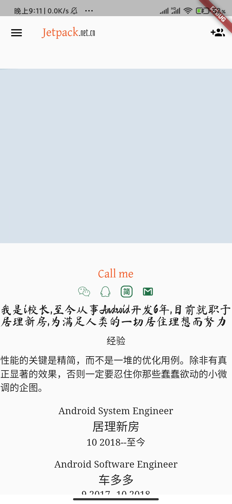

# jetpack

Flutter jetpack poject for you . 

## Running environment

- flutter
- node

## Getting Started

First step, when the environment configuration is complate, open terminal, run the following script.
```
/// step 1
flutter pub get
/// step 2
cd node/server/
npm install
/// step 3
. bin/test_start_node.sh
```
Then, open Chrome and input http://localhost:3000.

## UI Dart or Light



<p align="center">
	
	
</p>

<p align="center">
	
	
</p>

<p align="center">
	
	
</p>

<p align="center">
	
	
</p>

<p align="center">
	
	
</p>

## apk download

[flutter-jetpack](http://jetpack.net.cn/flutter-jetpack.apk)

## Blog

- [Flutter Web网站搭建教程](https://www.jianshu.com/p/cc1dcf3f5063)
- [Flutter Web 网站之主页框架搭建](https://www.jianshu.com/p/fcd1bcd50fb2)
- [Flutter Web网站之Jetpack成型](https://www.jianshu.com/p/fd7ef411a642)
